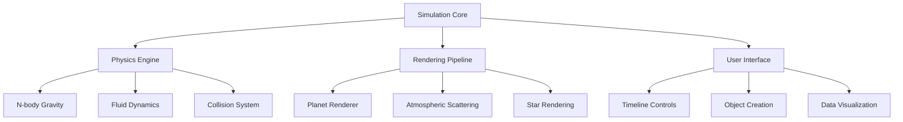

# 🌌 Whole New World Engine

> *"I can open your eyes, take you wonder by wonder, over sideways and under on a cosmic ride"*


<p align="center">
  
</p>

## 🚀 Overview

**Whole New World Engine** is an advanced astrophysical simulation framework built in Unity that recreates the physics of planetary systems with unprecedented accuracy and visual fidelity. This project provides a scientifically accurate and visually stunning recreation of cosmic phenomena from planetary formation to galactic motion.

---

## ✨ Features

<table>
  <tr>
    <td width="50%">
      <h3>🪐 Physical Simulation</h3>
      <ul>
        <li>N-body gravitational simulation with Runge-Kutta 4th order integration</li>
        <li>Relativistic effects near massive bodies</li>
        <li>Fluid dynamics for atmospheric and oceanic simulation</li>
        <li>Accurate orbital mechanics including Lagrange points</li>
        <li>Collision detection with physical deformation</li>
      </ul>
    </td>
    <td width="50%">
      
    </td>
  </tr>
  <tr>
    <td width="50%">
      
    </td>
    <td width="50%">
      <h3>🌈 Visual Rendering</h3>
      <ul>
        <li>Volumetric atmospheric scattering</li>
        <li>Dynamic day/night cycles with realistic lighting</li>
        <li>Custom planetary surface shaders</li>
        <li>Procedural terrain and cloud generation</li>
        <li>Realistic star rendering with spectral classification</li>
      </ul>
    </td>
  </tr>
</table>

### Technical Highlights

- [x] **Performance Optimization**
  ```csharp
  // Octree spatial partitioning for efficient large-scale simulation
  public class OctreeNode<T> where T : IPositionable
  {
      private readonly Bounds bounds;
      private readonly int maxObjects = 8;
      private readonly float minSize = 1.0f;
      // Implementation details...
  }
  ```

- [x] **GPU Acceleration** with compute shaders for physics calculations
- [x] **Multi-threading** for parallel processing of independent systems
- [x] **Adaptive time-stepping** for stability in complex scenarios

---

## 🎮 Interactive Controls

> Explore cosmic phenomena with intuitive controls

| Key Combination | Action |
|----------------|--------|
| <kbd>Space</kbd> | Play/Pause Simulation |
| <kbd>Shift</kbd> + <kbd>→</kbd> | Increase Time Scale |
| <kbd>Shift</kbd> + <kbd>←</kbd> | Decrease Time Scale |
| <kbd>Tab</kbd> | Toggle Data Visualization Mode |
| <kbd>Ctrl</kbd> + <kbd>N</kbd> | Create New Celestial Body |

---

## 📊 Data Visualization

The engine supports multiple visualization modes:

<details>
<summary>🔄 <b>Orbital Trajectories</b></summary>
<p>
Visualize predicted orbital paths with perturbation analysis.

```
Rendering Method: Bezier splines with adaptive segment count based on
orbital eccentricity and gravitational interference
```
</p>
</details>

<details>
<summary>🧲 <b>Gravitational Fields</b></summary>
<p>
Heat-map visualization of gravitational field strength and potential wells.
</p>
</details>

<details>
<summary>🌡️ <b>Thermal Mapping</b></summary>
<p>
Surface and atmospheric temperature visualization with seasonal variations.
</p>
</details>

---

## 🏗️ Architecture



---

## 📈 Performance Benchmarks

| Configuration | Bodies | Physics Updates/s | Frame Rate |
|---------------|--------|-------------------|-----------|
| RTX 3080      | 10,000 | 120               | 90 FPS    |
| RTX 2070      | 10,000 | 85                | 72 FPS    |
| GTX 1660      | 10,000 | 42                | 58 FPS    |

> 💡 **Note**: Performance varies based on enabled features and visualization modes

---

## 🛠️ Getting Started

### Prerequisites

- Unity 2022.3 or higher
- Compute Shader compatible GPU
- 8GB+ RAM recommended

### Installation

1. Clone the repository
   ```bash
   git clone https://github.com/yourusername/whole-new-world-engine.git
   ```

2. Open the project in Unity
   ```bash
   unity -projectPath whole-new-world-engine
   ```

3. Open the demo scene:
   `Assets/Scenes/SolarSystemDemo.unity`

---

## 📚 Documentation

Comprehensive documentation is available in the [Wiki](https://github.com/yourusername/whole-new-world-engine/wiki)

### Key Concepts

> **The Gravitational Solver**
>
> At the heart of the engine is our custom gravitational solver that handles interactions between thousands of bodies:
>
> $$F = G \frac{m_1 m_2}{r^2}$$
> 
> For relativistic effects, we implement the Einstein field equations in simplified form for real-time calculation:
>
> $$R_{\mu\nu} - \frac{1}{2}Rg_{\mu\nu} + \Lambda g_{\mu\nu} = \frac{8\pi G}{c^4}T_{\mu\nu}$$

---

## 📷 Gallery

<p align="center">
  
   
  
</p>

---

## 🤝 Contributing

Contributions are welcome! See [CONTRIBUTING.md](CONTRIBUTING.md) for guidelines.

- ⭐ Star the project
- 🐛 Report issues
- 🧪 Submit PRs

---

## 📜 License

This project is licensed under the MIT License - see the [LICENSE](LICENSE) file for details.

---

<p align="center">
  <i>A shining place I never knew, but when I'm way up here, it's crystal clear<br>That now I'm in a whole new world with you</i>
</p>
